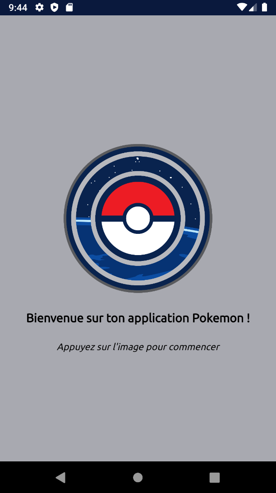
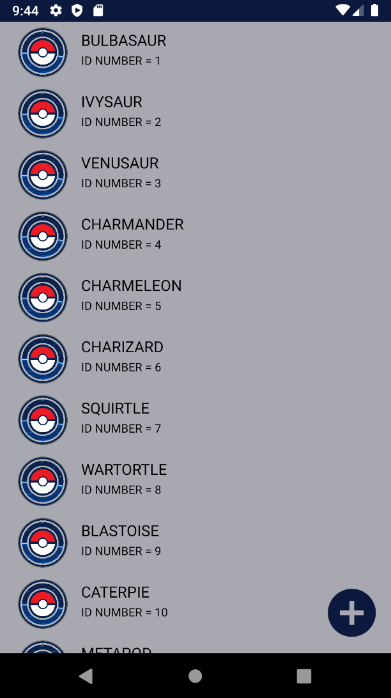
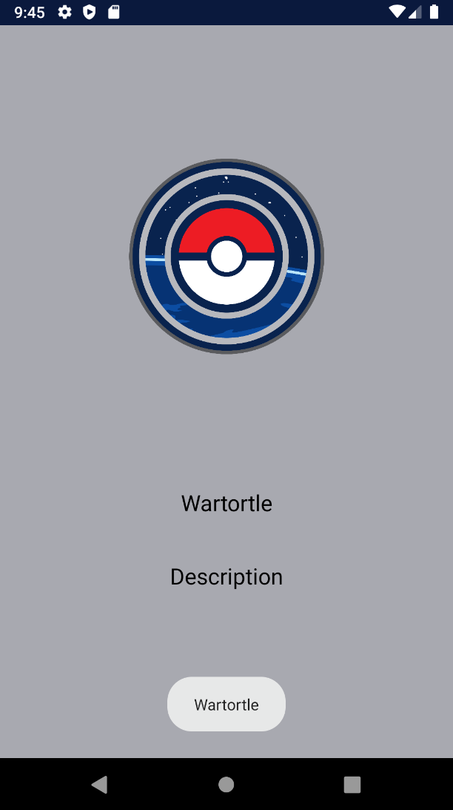

# Pokedex
### by Weezya

https://github.com/Weezya/Pokedex/

Projet de programmation mobile sur **Android Studio** développé par Loan et encadrée par Vincent, Lead Dev Android chez Engie.

## Présentation

Ce projet est une application programmée sous Android listant différents Pokémon (151 sur cette liste) à l'aide d'une API et capable de stocker les données en cache. Elle comporte trois activités principales :

- La page de lancement
- La liste des Pokémon
- La page de description pour chaque Pokémon

Voici des photos des trois activités respectives :

| Lancement       | Liste           | Description           |
|     :---:    |     :---:      |   :---:      |
||||

## Consignes respectées

- 3 écrans (3 activités)
- Appel WebService à une API Rest avec Retrofit
- Affichage de la liste dans un RecyclerView
- Stockage des données en cache.
- Architecture MVC (Model, View, Controller)
- Gitflow avec les branches Master et Develop
- Animation : ProgressBar en cercle lors de la récupération des données


L'API initialement utilisée est l'API de l'enseignant :
````
https://pokeapi.co/api/v2/
````
Finalement, l'API utilisée est la suivante :
````
https://raw.githubusercontent.com/Biuni/PokemonGO-Pokedex/master/
````


## Diverses techniques employées :

- Listener
- Button (image sur la page de lancement)
- Intent
- Notification (à l'ouverture de la description du Pokémon)
- RecyclerView
- Adapter
- ViewHolder
- LinearLayout
- RelativeLayout
- ConstraintLayout
- Changement du nom et de l'icône de l'application
- Utilisation de couleurs personnalisées dans les values/colors
- Ajout d'images dans les drawable
- Fabrication de l'APK
- Utilisation d'un Android Virtual Device pour la simulation

## Fonctionnalités des différentes activités

- Page de lancement :

La page de lancement est une activité qui se lance au démarrage de l'application. Elle comporte une image et deux lignes de textes. Il faut cliquer sur l'image pour lancer la liste de Pokémon comme indiquée en dessous.

- Liste des Pokémon :

La liste de Pokémon est un RecyclerView issu d'une API prétéléchargée via **Internet** et qui a la capacité d'**être stockée en cache** par la suite. Lorsqu'on a cliquée sur le logo de la page de lancement, une bar de progression en cercle apparait puis disparait lorsque les données sont chargées.

- Description pour chaque Pokémon :

La page de description comporte une photo (normalement du Pokémon), son nom et une notification avec son nom également qui apparait dès qu'on affiche cette page et qui disparait après quelques secondes. Pour revenir sur la liste il suffit d'utiliser le bouton retour d'Android.

## Récapitulatif des activités

|Activité          |Classe Java        |
|------------------|-------------------|
|Page de lancement |LaunchActivity     |
|Liste de Pokémon  |MainActivity       |
|Description       |DescripActivity    |

## Problèmes rencontrés :

- Picassso pour charger une image via une URL
- La documentation sur Internet est parfois obsolète

## Axes d'amélioration :

- Utiliser une API compatible avec la version de l'AVD pour Picasso
- Rajouter du contenu dans la description de chaque Pokémon

## Conclusion

Ce projet m'a permis de comprendre un peu mieux comment fonctionne une application mobile et quels moyens de base il faut utiliser pour la développer. La formation que j'ai reçu m'a beaucoup enrichit, je recommande fortement les compétences de Vincent.

